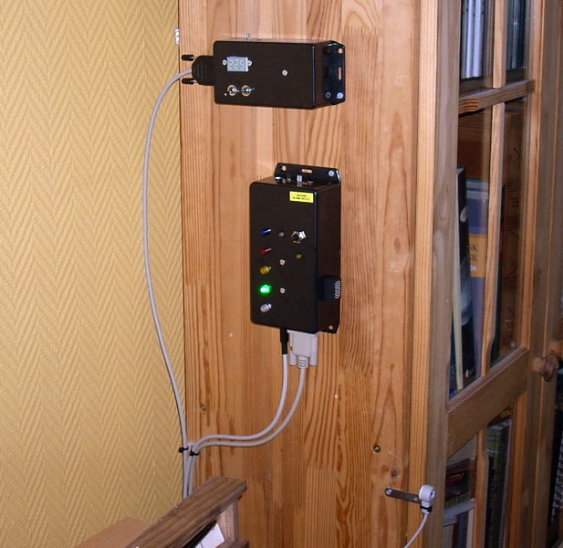

## Source code for project: [Environmental sensor and signalling unit](https://link.stdout.no/i)

Two analog sensors: temperature (LM35) and light intensity (TSL252R), five colored LEDs for signals and a buzzer, Uses an AVR ATmega8 microcontroller.

Written in basic, using [Bascom-AVR](http://www.mcselec.com/).

### Author
[Thomas Jensen](https://thomas.stdout.no)
